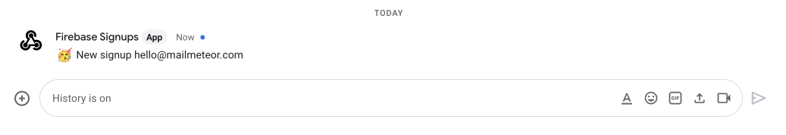

# Be notified of new signups in your app using Firebase Authentication and Google Chat

**Author**: Mailmeteor (**[https://mailmeteor.com/](https://mailmeteor.com/)**)

**Description**: Get notified right into Google Chat of your new users recorded in Firebase Authentication.

**Details**: This extension posts a new message in Google Chat whenever a new user is recorded in your Firebase Authentication project.



You can configure the message and add additional information saved in the [Firebase Authentication user record](https://firebase.google.com/docs/reference/admin/node/firebase-admin.auth.userrecord).

Here's a gist of how this extension works:

```js
exports.sendSignupToGoogleChat = functions.auth.user().onCreate((user) => {
  const message = `🥳 New signup ${user.email || "(no email)"}`;

  return fetch(GOOGLE_CHAT_WEBHOOK_URL, {
    method: "POST",
    headers: { "Content-Type": "application/json; charset=UTF-8" },
    body: JSON.stringify({ text: message }),
  });
});
```

### Additional Setup

Before installing this extension, make sure to retrieve the [Google Chat Webhook URL](https://developers.google.com/chat/how-tos/webhooks#step_1_register_the_incoming_webhook) of your space. The webhook URL is currently accessible only to Google Workspace accounts.

```js
const GOOGLE_CHAT_WEBHOOK_URL = "https://chat.googleapis.com/v1/spaces/....";
```

### Note from Firebase

Your Firebase project must be on the Blaze (pay-as-you-go) plan to install the extension. You will only be charged for the resources you use. Most Firebase services offer a free tier for low-volume use. [Learn more about Firebase billing.](https://firebase.google.com/pricing)

When installing or reconfiguring this extension, you will be billed a small amount (typically less than $0.10). See Cloud Functions under [Firebase Pricing](https://firebase.google.com/pricing) for a detailed explanation.
